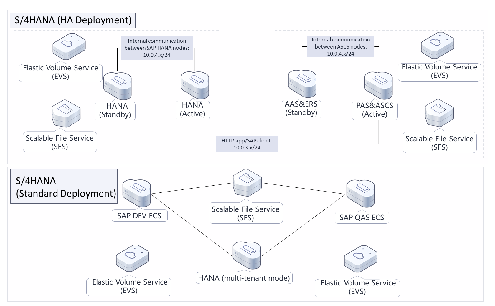
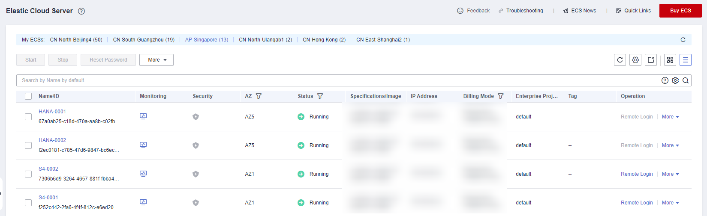

[TOC]

**Solution Overview**
===============
This solution allows you to create cloud resources required for deploying SAP S/4HANA 1809 in high availability (HA) mode on Huawei Cloud with just a few clicks. Deploying SAP S/4HANA on Huawei Cloud provides you with full access to Huawei Cloud's lifecycle management services, large capacity, strong security, and high performance. It helps you simplify enterprise management, reduce costs, optimize operations, and facilitate digital transformation.

For more details about this solution, visit: https://www.huaweicloud.com/intl/en-us/solution/implementations/qdcesaps4hana.html

**Architecture**
---------------


**Architecture Description**
---------------
This solution will:

1. Create one VPC and three subnets to provide isolated networks.
2. Create a security group and configure security group rules to protect ECSs.
3. Create three virtual IP addresses required for configuring HA.
4. Create four ECSs for installing SAP S/4HANA 1809.
5. Create five SFS Turbo file systems to provide shared file storage.


**File Structure**
---------------

``` lua
huaweicloud-solution-rapid-deployment-of-sap-s4hana-cloud-environment
├── rapid-deployment-of-sap-s4hana-cloud-environment-standard.tf.json -- Standard resource orchestration template
├── rapid-deployment-of-sap-s4hana-cloud-environment-ha.tf.json -- HA resource orchestration template
├── userdate
    ├── init-sap-s4hana-standard.sh   -- Standard resource script configuration file
    ├── init-sap-s4hana-ha.sh   -- HA resource script configuration file
```
**Getting Started**
---------------
1. Log in to the [Huawei Cloud ECS console](https://console-intl.huaweicloud.com/ecm/?agencyId=WOmAijZnbElNjCFzTVDl4aJQAgdaTUMD&locale=en-us&region=ap-southeast-3#/ecs/manager/vmList) to view the created ECSs.

	Figure 1 Created ECSs

	

2. Visit the [SAP S/4HANA (1809) HA Deployment Best Practice](https://support.huaweicloud.com/intl/en-us/bestpractice-sap/en-us_topic_0000001165507753.html) and perform operations in section "Software Installation".
> [**Note:**]
>
> Except **Configuring SSH Switching Permissions**, all operations in section "Resource Creation" of the best practice will be automatically performed. You only need to proceed to the follow-up steps. Configure the SSH switching permissions manually if needed.
